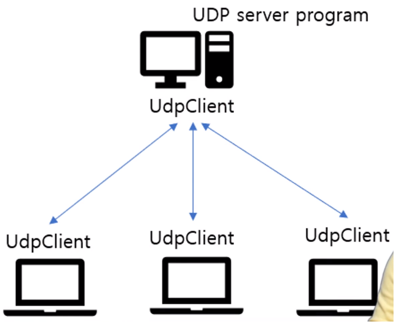

# [Inflearn] C# 네트워크 프로그래밍

# 01강 - 네트워크 기본 구조와 원리

[TOC]

## 1. 서버와 클라이언트 개념

### 1) 네트워크의 기본 개념
- 프로토콜(protocol)

  인터넷 상에서 컴퓨터 간의 데이터를 주고 받기 위한 약속된 형식 → 통신규약

- OSI 7 계층

  : 컴퓨터 네트워크 프로토콜 디자인과  통신을 계층으로 구분하여 규정 → 프로토콜을 기능별로 구분

  | 응용 프로그램 계층 |
  | :----------------: |
  | 프리젠테이션 계층  |
  |     세션 계층      |
  |   **전송 계층**    |
  |   네트워크 계층    |
  |  데이터 링크 계층  |
  |      물리계층      |

- 서버 (Server)

  : 클라이언트에게 네트워크를 통해 정보나 서비스를 제공하는 컴퓨터 또는 프로그램

- 클라이언트 (Client)

  : 네트워크를 통하여 서버라는 다른 컴퓨터 시스템 상의 원격 서비스에 접속할 수 있는 응용 프로그램 또는 사용자 컴퓨터  (대표적인 클라이언트 프로그램 -  웹브라우저, 게임 등 사용자 입장의 프로그램)

## 2. TCP/IP 서버와 클라이언트

### 1) TCP/IP

- 전송 계층

- 운영체제의 일부로 구현되어 있음

- **전송방식**

  - TCP(Transmission Control Protocol) - 에러 검출, 재전송 등 데이터 신뢰성
  - UDP - 빠른 전송

- **서버에서 다수 클라이언트 응용프로그램 구분**

  - 포트(port) 번호

    :  접속된 다수의 응용프로그램을 구분하기 위한 번호

  - 포트 번호의 범위(0~65535) : 예약된 번호 (0 ~ 1023), **1024~49151 중 하나 선택**

    | 포트번호 | 항목        |
    | -------- | ----------- |
    | 7HTTP    | 에코(echo)  |
    | 13       | DayTime     |
    | 21, 23   | FTP, Telnet |
    | 25       | SMTP        |
    | 80       | HTTP        |

    

### 2) TCP 서버와 클라이언트

- TCP 서버의 기본 구조

  : ① 대기 상태 → ② 접속 요청 → ③ 데이터 전송

- TCP 서버와 클래스

  - TcpListener : 연결과 TcpClient 객체 생성
  - TcpClient : 데이터 전송 (NetworkStream)

- TCP 서버와 클래스 관계

  

- TCP 서버와 다수의 클래스

### 3) UDP 서버와 클라이언트

- 기본적인 것은 TCP와 동일

- UDP 서버는 주고받는 요청없이 데이터를 받기 위한 대기 상태

- Client가 데이터를 보내면 바로 받아 데이터를 처리 (즉각적인 반응)

- UDP 서버와 클래스

  - 비연결형 ?  IP 주소와 port 번호를 알면 데이터 전송 가능

- **"UdpClient"** 서버와 클라이언트 모두 사용

- 그룹 처리

  : UdpClient.JoinMulticast() 사용

