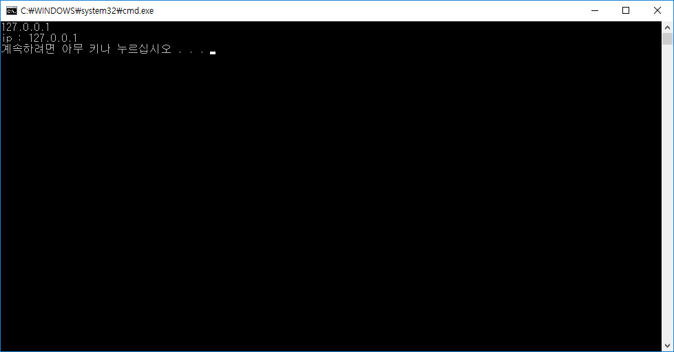
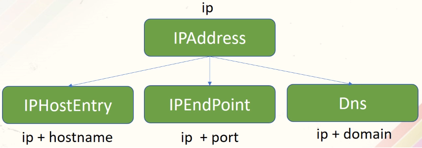
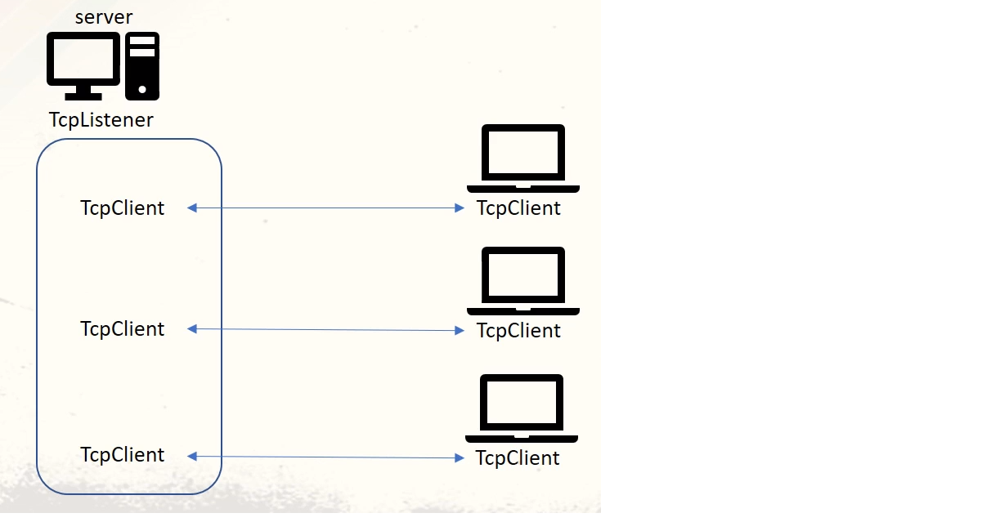
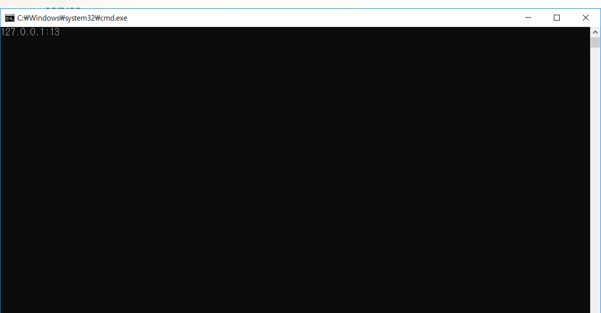
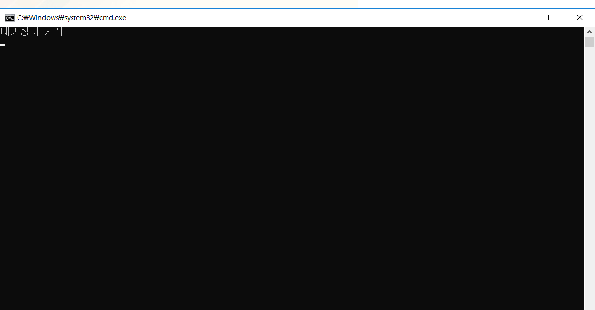
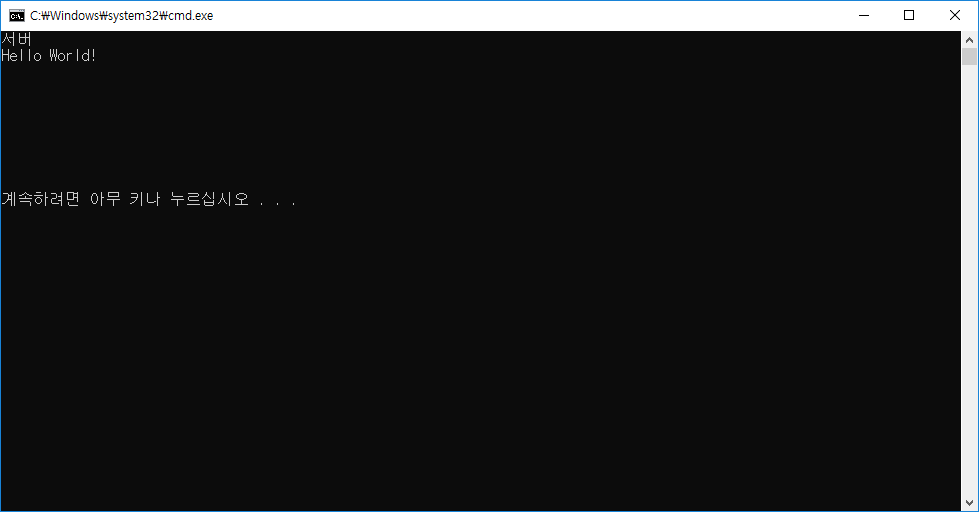
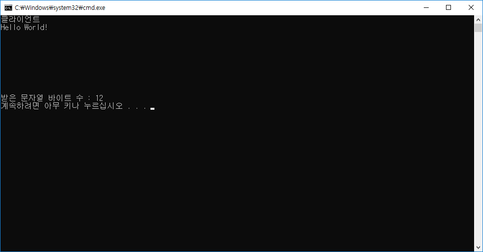
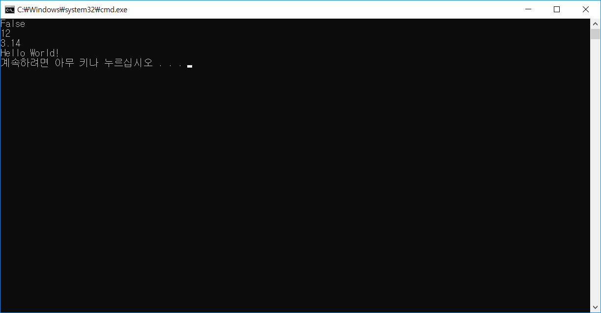

# [Inflearn] C# 네트워크 프로그래밍

# 02강 - 네트워크 클래스

[TOC]

## 1. 네트워크 클래스 지도 보기

### 1) 정보 클래스 (IPAddress, Dns, IPHostEntry, IPEndPoint)

#### (1) IPAddress

- IP 주소 형식  - ex) 127.0.0.1 (0~255)

- IP 주소의 실체

  - Long형 값 (8 Byte)

- IPAddress 역할 

  - IP 주소 ↔ Long형 변환

  - ```public static IPAddress Parse(string ipString)```

    : ipString → "127.0.0.1" 주소 설정

  - ```public override string ToString()```: 내부 저장된 IP주소 반환

- [Code]

  ```c#
  namespace IPAddress01
  {
      class Program
      {
          static void Main(string[] args)
          {
              string Address = Console.ReadLine();
              IPAddress IP = IPAddress.Parse(Address);
              Console.WriteLine("ip : {0}", IP.ToString());
          }
      }
  }
  ```

- [Result]

  

#### (2) Dns

- 역할 

  : 도메인명과 IP 주소 관리 - ex) www.naver.com  124.244.178.250

  - ```public static IPHostEntry GetHostEntry(IPAddress address 또는 string hostNameOrAddress)```

    → address의 IP주소로 도메인명 검색하여 저장

  - ```public static IPAddress[] GetHostAddresses(string hostNameOrAddress)```

    → 도메인명으로 IP 주소 검색 및 저장

- [Code]

  ```c#
  namespace Dns01
  {
      class Program
      {
          static void Main(string[] args)
          {
              IPAddress[] IP = Dns.GetHostAddresses("www.naver.com");
              foreach (IPAddress HostIP in IP)
              {
                  Console.WriteLine("{0}", HostIP);
              }
          }
      }
  }
  ```

- [Result]


#### (3) IPHostEntry

- 역할

  : 도메인명과 IP 주소를 저장하는 컨테이너 

- Dns와 연결하여 사용

  : IPHostEntry HostInfo = Dns.GetHostEntry("www.naver.com")

- ```public IPAddress[] AddressList { get; set; }```

  : 다수의 IP 주소 저장 → IPAddress

- ```public string HostName { get; set; }```

  : 호스트명을 설정 또는 얻기

- [Code]

  ```c#
  namespace IPHostEntry01
  {
      class Program
      {
          static void Main(string[] args)
          {
              IPHostEntry HostInfo = Dns.GetHostEntry("www.naver.com");
  
              foreach (IPAddress ip in HostInfo.AddressList)
              {
                  Console.WriteLine("{0}", ip);
              }
              Console.WriteLine("{0}", HostInfo.HostName);
          }
      }
  }
  ```

- [Result]

  

#### (4) IPEndPoint

- 역할

  : 목적지 IP 주소와 포트번호를 저장

- IP주소와 Port 번호 설정

  - ```public IPEndPoint(long address, int port)```
  - ```public IPEndPoint(IPAddress address, int port)```

- Address 속성

  - ```public IPAddress Address { get; set; }```

- Port 속성

  - ```public int port { get; set; }```

- [Code]

  ```c#
  namespace IPEndPoint01
  {
      class Program
      {
          static void Main(string[] args)
          {
              IPAddress IPInfo = IPAddress.Parse("127.0.0.1");
              int Port = 13;
              IPEndPoint EndPointInfo = new IPEndPoint(IPInfo, Port);
              Console.WriteLine("IP : {0} Port : {1}", EndPointInfo.Address, EndPointInfo.Port);
              Console.WriteLine(EndPointInfo.ToString());
              Console.ReadKey();
          }
      }
  }
  ```

- [Result]

  

#### (5) 정리



- IPAddress, IPHostEntry, IPEndPoint, Dns는 클래스이지만 구조체 정도 수준
- 서로 연관됨


### 2) 연결 클래스 (TcpListener, TcpClient, UdpClient)

- 구분 
  - TCP : TcpListener (서버), TcpClient(서버 & 클라이언트)
  - UDP : UdpClient (서버 & 클라이언트)  - Socket 기반 (Winsock)
- namespace 선언
  - ```using System.Net.Sockets```

#### (1) TcpListener / TcpClient

- **TcpListener**

  - 서버와 클라이언트를 구분할 수 있는 클래스

    → 클라이언트 연결을 대기 (대기 상태)

  - 역할 

    - 클라이언트 연결 대기

    - TcpClient 생성

      

  - 생성자 : 서버 IP 주소와 포트 번호 설정

  - ```c#
    // IPAddress.Parse("IP 주소"); 적용
    public TcpListener(IPAddress localaddr, int port)
    public TcpListener(IPEndPoint localEP)
    ```

    [Code]

    ```c#
    using System.Net;
    using System.Net.Sockets;
    
    namespace TcpListener01
    {
        class Program
        {
            static void Main(string[] args)
            {
                IPAddress ip = IPAddress.Parse("127.0.0.1");
                TcpListener tcpListener = new TcpListener(ip, 13);
                Console.WriteLine("{0}", tcpListener.LocalEndpoint.ToString());
                Console.ReadKey();
            }
        }
    }
    ```

  - [Result]

    

  -  TcpListener.Start()와 TcpListener.Stop()

    : TcpListener 대기상태 시작과 정지 - TcpListener.AcceptTcpClient() 이전에 수행

  -  **TcpListener.AcceptTcpClient() : 클라이언트 요청 대기 및 TcpClient 생성 → 연결수락**

  - [Code]

    ```c#
    using System.Net;
    using System.Net.Sockets;
    
    namespace TcpListener01
    {
        class Program
        {
            static void Main(string[] args)
            {
                TcpListener tcpListener = new TcpListener(IPAddress.Parse("127.0.0.1"), 7);
                tcpListener.Start();
                Console.WriteLine("대기상태 시작");
                TcpClient tcpClient = tcpListener.AcceptTcpClient();  // 대기상태로 들어감
                
                Console.WriteLine("대기상태 종료");
                tcpListener.Stop();
            }
        }
    }
    ```

  - [Result]

    


- **TcpClient**

  - 특징 : 서버와 클라이언트 모두 사용 

  - 역할 : 서버와 클라이언트 연결 및 요청

  - TcpClient  생성자

    - IP 주소와 포트 설정 → 연결 통로 설정

      : ```public TcpClient(string hostname, int port)```

  - [Code]

    ```c#
    using System.Net;
    using System.Net.Sockets;
    
    namespace TcpClient01
    {
        class Program
        {
            static void Main(string[] args)
            {
                TcpClient tcpClient = new TcpClient("192.168.0.10", 7);
                if (tcpClient.Connected)
                    Console.WriteLine("서버 연결 성공");
                else
                    Console.WriteLine("서버 연결 실패");
    
                tcpClient.Close();
                Console.ReadKey();
            }
        }
    }
    ```

  - [Result] - TcpClient

    

  - [Result] - TcpListener

     

  - 생성자 외의 연결 요청 메소드

    ```c#
    public void Connect(IPAddress address, int port)
    public void Connect(IPAddress[] ipAddress, int port)
    public void Connect(IPEndPoint remoteEP)
    public void Connect(string hostname, int port)
    ```

  - 연결 해제

    - ```TcpClient.Close()```

  - 데이터 전송 스트림

    - TCP → NetworkStream 사용
    - ```public NetworkStream GetStream()``` - Byte 전송
    - Encoding.ASCII.GetBytes() 등 제공
    - **NetworkStream.Read() / Write() 사용**

  - [Code]

    <Listener>

    ```c#
    using System.Net;
    using System.Net.Sockets;
    
    namespace TcpListener01
    {
        class Program
        {
            static void Main(string[] args)
            {
                TcpListener tcpListener = new TcpListener(IPAddress.Parse("192.168.0.10"), 7);
                tcpListener.Start();
                Console.WriteLine("대기 상태");
                TcpClient tcpClient = tcpListener.AcceptTcpClient();
                NetworkStream ns = tcpClient.GetStream();
    
                byte[] ReceiveMessage = new byte[100];
                ns.Read(ReceiveMessage, 0, 100);
                string strMessage = Encoding.ASCII.GetString(ReceiveMessage);
                Console.WriteLine(strMessage);
    
                string EchoMessage = "Hi~~";
                byte[] SendMessage = Encoding.ASCII.GetBytes(EchoMessage);
                ns.Write(SendMessage, 0, SendMessage.Length);
                
                ns.Close();
                tcpClient.Close();
                tcpListener.Stop();
                Console.ReadKey();
            }
        }
    }
    ```

    <Client>

    ```c#
    using System.Net;
    using System.Net.Sockets;
    
    namespace TcpClient01
    {
        class Program
        {
            static void Main(string[] args)
            {
                TcpClient tcpClient = new TcpClient("192.168.0.10", 7);
                if (tcpClient.Connected)
                {
                    Console.WriteLine("서버 연결 성공!");
                    NetworkStream ns = tcpClient.GetStream();
                    string Message = "Hello Wolrd!";
                    byte[] SendByteMessage = Encoding.ASCII.GetBytes(Message);
                    ns.Write(SendByteMessage, 0, SendByteMessage.Length);
    
                    byte[] ReceiveByteMessage = new byte[32];
                    ns.Read(ReceiveByteMessage, 0, ReceiveByteMessage.Length);
                    string ReceiveMessage = Encoding.ASCII.GetString(ReceiveByteMessage);
                    Console.WriteLine(ReceiveMessage);
                    ns.Close();
                }
                else
                {
                    Console.WriteLine("서버 연결 실패!");
                }
    
                tcpClient.Close();
                Console.ReadKey();
            }
               
        }
    }
    
    ```

  - [Result]

    <Listener>

    

    <Client>

    

#### (2) UdpClient

 

### 3) 전송 클래스

#### (1) NetworkStream

- 역할

  : TCP 연결에서 데이터 송수신 스트림

- 스트림 데이터 쓰기

  - ```public override void Write(byte[] buffer, int offset, int size)```

- 스트림 데이터 읽기

  - ```public override int Read(byte[] buffer, int offset, int size)```
  - 리턴값 : 읽은 바이트 수, 리턴값이 0이면 읽을 데이터가 없음 

- NetworkStream.CanRead, NetworkStream.CanWrite

  - 스트림에 데이터를 읽고 쓸 수 있는지 확인

  - ```public override bool CanRead { get; }```

  - ```public override bool CanWrite { get; }```

  - 리턴값 : true, false

  - [Code]

    <Listener>

    ```c#
    using System.Net;
    using System.Net.Sockets;
    
    namespace TcpListener01
    {
        class Program
        {
            static void Main(string[] args)
            {
                TcpListener tcpListener = new TcpListener(IPAddress.Any, 7);
                tcpListener.Start();
                byte[] Buffer = new byte[1024];
                int TotalByteCount = 0, ReadByteCount = 0;
    
                Console.WriteLine("서버");
    
                TcpClient tcpClient = tcpListener.AcceptTcpClient();
                NetworkStream ns = tcpClient.GetStream();
    
                while (true)
                {
                    ReadByteCount = ns.Read(Buffer, 0, Buffer.Length);
                    if (ReadByteCount == 0)
                        break;
                    TotalByteCount += ReadByteCount;
                    ns.Write(Buffer, 0, ReadByteCount);
                    Console.WriteLine(Encoding.ASCII.GetString(Buffer));
                }
    
                ns.Close();
                tcpClient.Close();
                tcpListener.Stop();
            }
        }
    }
    ```

    <Client>

    ```c#
    using System.Net;
    using System.Net.Sockets;
    
    namespace TcpClient01
    {
        class Program
        {
            static void Main(string[] args)
            {
                TcpClient tcpClient = new TcpClient("localhost", 7);
                NetworkStream ns = tcpClient.GetStream();
                Console.WriteLine("클라이언트");
                byte[] Buffer = new byte[1024];
                byte[] SendMessage = Encoding.ASCII.GetBytes("Hello World!");
                ns.Write(SendMessage, 0, SendMessage.Length);
                int TotalCount = 0, ReadCount = 0;
    
                while (TotalCount < SendMessage.Length)
                {
                    ReadCount = ns.Read(Buffer, 0, Buffer.Length);
                    TotalCount = ReadCount;
    
                    string RecvMessage = Encoding.ASCII.GetString(Buffer);
                    Console.WriteLine(RecvMessage);
                }
    
                Console.WriteLine("받은 문자열 바이트 수 : {0}", TotalCount);
                ns.Close();
                tcpClient.Close();
            }      
        }
    }
    ```

  - [Result]

    <Listener>

    

    <Client>

    

#### (2) StreamWriter / StreamReader

- **StreamWriter**

  - 역할

    : 문자열의 끝에 종결자(```'\n', '\r\n', '\r'```)를 붙여 쓰기

  - StreamWriter 생성자 : 스트림 설정

    - ```public StreamWriter(Stream stream)```

  - 종결자와 함께 쓰기

    - ```StreamWriter.WriteLine()```

      ```c#
      public virtual void WriteLine(bool value)
      public virtual void WriteLine(char value)
      public virtual void WriteLine(double value)
      public virtual void WriteLine(int value)
      public virtual void WriteLine(long value)
      public virtual void WriteLine(float value)
      public virtual void WriteLine(string value)
      ```

    - MSDN 참고

  - StreamWriter 해제

    - ```StreamWriter.Close()```

      ```c#
      NetworkStream ns = tcpClient.GetStream();
      using(StreamWriter sw = new StreamWriter(ns))
      {
          .........
      }
      ```

- **StreamReader**

  - 역할

    :  StreamWriter에서 전달하는 문자열을 종결자 단위로 읽기

  - 생성자 : 스트림 설정

    - ```public StreamReader(Stream stream)```

      ```c#
      NetworkStream ns = tcpClient.GetStream();
      using(StreamReader sr = new StreamReader(ns))
      {
          ..........
      }
      ```

  - 종결자 단위로 읽기

    - ```StreamReader.ReadLine()```

      ```c#
      public override string ReadLine()	// return 값이 null이면 읽을 것이 없음
      ```

  - StreamReader 해제

    - ```StreamReader.Close()```

      → using 문 사용

- [Code]

  - Listener

    ```c#
    using System.Net;
    using System.Net.Sockets;
    using System.IO;
    
    namespace StreamWriter01
    {
        class Program
        {
            static void Main(string[] args)
            {
                TcpListener tcpListener = new TcpListener(3000);
                tcpListener.Start();
                TcpClient tcpClient = tcpListener.AcceptTcpClient();
    
                bool YesNo = false;
                int Val1 = 12;
                float Pi = 3.14f;
                string Message = "Hello World!";
    
                NetworkStream ns = tcpClient.GetStream();
                using (StreamWriter sw = new StreamWriter(ns))
                {
                    sw.AutoFlush = true;
                    sw.WriteLine(YesNo);
                    sw.WriteLine(Val1);
                    sw.WriteLine(Pi);
                    sw.WriteLine(Message);
                }
                ns.Close();
                tcpClient.Close();
                tcpListener.Stop();
            }
        }
    }
    ```

  - Client

    ```c#
    using System.Net;
    using System.Net.Sockets;
    using System.IO;
    
    namespace StreamReader01
    {
        class Program
        {
            static void Main(string[] args)
            {
                char[] buffer = new char[100];
                TcpClient tcpClient = new TcpClient("localhost", 3000);
                NetworkStream ns = tcpClient.GetStream();
                using (StreamReader sr = new StreamReader(ns))
                {
                    string str = sr.ReadLine();
                    Console.WriteLine(str);
                    str = sr.ReadLine();
                    Console.WriteLine(str);
                    str = sr.ReadLine();
                    Console.WriteLine(str);
                    str = sr.ReadLine();
                    Console.WriteLine(str);
                }
    
                ns.Close();
                tcpClient.Close();
            }
        }
    }
    ```

- [Result]

  - Listener

    

  - Client

    

- **[중간 정리]**

  - NetworkStream은 기본 전달 경로 제공

  - StreamWriter와 StreamReader

    : string형 + 종결자 ('\n', '\r\n', '\r')  → 데이터를 다루기가 쉽다.

  - NetworkStream + StreamWriter, StreamReader 사용

    : 코드적인 편의 + 생산성 증가

#### (3) BinaryWriter / BinaryReader

- Stream 입출력에 대해

  - 이진 파일 / BinaryWriter, BinaryReader
  - 텍스트 파일 / StreamReader, StreamWriter
  - 공통점 : 0과 1로 된 데이터로 구성
  - 차이점 : 임의의 데이터형 해석 → 이진, 1바이트 단위형 해석 → 일반

- **BinaryWriter**

  - 역할 

    : NetworkStream을 통해 임의의 데이터 전송,  기본 0,1

  - System.IO namespace 선언 필요

  - 생성자 - 연결할 NetworkStream 설정

    ```public BinaryWriter(Stream output)```

    ```c#
    NetworkStream ns = tcpClient.GetStream();
    using(BinaryWriter bw = new BinaryWriter(ns))
    {
        ........
    }
    ```

  - 임의의 데이터형 쓰기

    - ```BinaryWriter.Write()```

      ```c#
      public virtual void Write(bool value)
      public virtual void Write(byte value)
      public virtual void Write(char ch)
      public virtual void Write(int value)
      public virtual void Write(long value)
      public virtual void Write(float value)
      public virtual void Write(string value)
      ```

    - MSDN 참고

  - BinaryWriter 해제

    - ```BinaryWriter.Close()```

      ```c#
      // using 문 사용
      using(BinaryWriter bw = new BinaryWriter(ns))
      {
          ........
      }
      ```

      

- **BinaryReader**

  - 생성자 : 연결할 NetworkStream 설정

    - ```public BinaryReader(Stream input)```

  - BinaryWriter 데이터 읽기

    - ```BinaryReader.ReadXXX()```

      ```c#
      public virtual bool ReadBoolean()
      public virtual byte ReadByte()
      public virtual byte[] ReadBytes(int count)
      public virtual char ReadChar()
      public virtual char[] ReadChars(int count)
      public virtual double ReadDouble()
      public virtual int ReadInt32()
      public virtual long ReadInt64()
      public virtual float ReadSingle()
      public virtual string ReadString()
      ```

    - BinaryWriter.Write()

      float ------------------------------------ BinaryReader.ReadSingle()

      int --------------------------------------- BinaryReader.ReadSingle()

      string ----------------------------------- BinaryReader.ReadString()

  - BinaryReader 해제

    - ```BinaryReader.Close()```

- [Code]

  - Listener

    ```c#
    using System.Net;
    using System.Net.Sockets;
    using System.IO;
    
    namespace BinaryWriter01
    {
        class Program
        {
            static void Main(string[] args)
            {
                TcpListener tcpListener = new TcpListener(IPAddress.Any, 3000);
                tcpListener.Start();
    
                TcpClient tcpClient = tcpListener.AcceptTcpClient();
                NetworkStream ns = tcpClient.GetStream();
                using (BinaryWriter bw = new BinaryWriter(ns))
                {
                    bool YesNo = false;
                    int Number = 12;
                    float Pi = 3.14f;
                    string Message = "Hello World!";
    
                    bw.Write(YesNo);
                    bw.Write(Number);
                    bw.Write(Pi);
                    bw.Write(Message);
                }
                ns.Close();
                tcpClient.Close();
                tcpListener.Stop();
            }
        }
    }
    ```

  - Client

    ```c#
    using System.Net;
    using System.Net.Sockets;
    using System.IO;
    
    namespace BinaryReader01
    {
        class Program
        {
            static void Main(string[] args)
            {
                bool YesNo;
                int Number;
                float Pi;
                string Message;
    
                TcpClient tcpClient = new TcpClient("localhost", 3000);
                NetworkStream ns = tcpClient.GetStream();
                using(BinaryReader br = new BinaryReader(ns))
                {
                    YesNo = br.ReadBoolean();
                    Number = br.ReadInt32();
                    Pi = br.ReadSingle();
                    Message = br.ReadString();
                }
                ns.Close();
                tcpClient.Close();
    
                Console.WriteLine(YesNo);
                Console.WriteLine(Number);
                Console.WriteLine(Pi);
                Console.WriteLine(Message);
            }
        }
    }
    ```

    

- [Result]

  - Listener

    

  - Client

    

- 데이터 변환 클래스와 메서드

  - System.Text.Encoding 클래스 사용

  - System.Text 기본 namespace

    ```c#
    public virtual byte[] GetBytes(char[] chars)
    public virtual byte[] GetBytes(string s)
    public virtual char[] GetChars(byte[] bytes)
    public virtual string GetString(byte[] bytes)
    ```

    