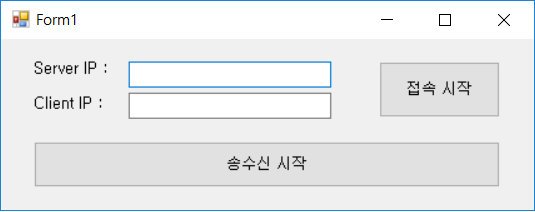
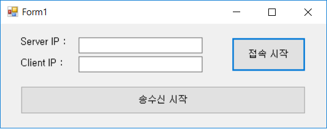
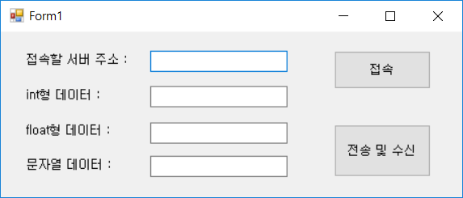
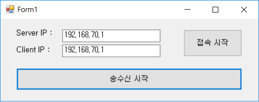
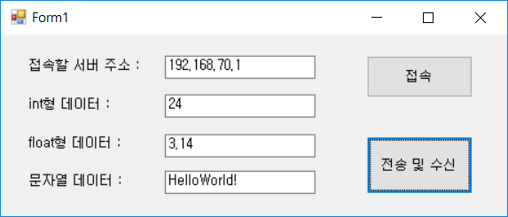

# [Inflearn] C# 네트워크 프로그래밍

# 03강 - 콘솔코드를 윈도우 코드로 변환

[TOC]

## 1. 콘솔 서버 코드를 윈도우 서버 코드로 옮기기

- 폼 디자인은 코드 설계이다

  

  - 콘솔형 프로그래밍 특징 

    : 순차적인 논리

  - 윈도우 프로그래밍 특징 

    : 이벤트에 따른 반응 논리

  - 폼 디자인은 코드량을 결정

  - 기능에 따라 폼 디자인과 컨트롤 수가 결정

    - 서버 IP 출력, 접속 시작 버튼, 클라이언트 주소 출력, 송수신 시작

### 1) 서버 IP 주소 찾아 출력하기

- 호스트명 알아내기

  - ```Dns.GetHostName()```

    ```c#
    public static string GetHostName()
    ```

- 호스트 정보 가져오기

  - ```Dns.GetHostEntry()```

    ```c#
    public static IPHostEntry GetHostEntry(string hostNameOrAddress)
    ```

- IPHostEntry는 컨테이너 클래스

  - IPHostEntry.AddressList 속성

    ```c#
    public IPAddress[] AddressList { get; set; }
                ↑ 
            IPv4, IPv6
    ```

  - 걸러내는 방법 제공

    : 열거형값을 구분 → AddressFamily.InterNetwork

- [Code]

  ```c#
  private void Form1_Load(object sender, EventArgs e)
  {
      IPHostEntry host = Dns.GetHostEntry(Dns.GetHostName());
      for (int i = 0; i < host.AddressList.Length; i++)
      {
          if (host.AddressList[i].AddressFamily == AddressFamily.InterNetwork)
          {
              textBox1.Text = host.AddressList[i].ToString();
              break;
          }
      }
  }
  ```

  

### 2) TcpListener 적용 → TcpClinet 대기

- tcpListener 생성자 적용

  ```c#
  private void Form1_Load(object sender, EventArgs e)
  {
      tcpListener = new TcpListener(3000);
      tcpListener.Start();
  }
  ```

- TcpListener.AcceptTcpClient 적용

  : TcpListener.AcceptTcpClient() 역할 → TcpClient 생성과 대기상태 유지

  - **"접속 시작"** 버튼으로 클릭으로 처리

    

    1) TcpClient 생성

    2) BinaryWriter/BinaryReader 생성

    3) 접속자 IP 얻기

  - [Code]

    ```c#
    public partial class Form1 : Form
    {
    	private TcpClient tcpClient = null;
    	private TcpListener tcpListener = null;
    	private BinaryWriter bw = null;
    	private BinaryReader br = null;
    	private NetworkStream ns;
    
    	// 접속 시작 버튼
    	private void button1_Click(object sender, EventArgs e)
    	{
    		tcpClient = tcpListener.AcceptTcpClient();
    		if (tcpClient.Connected)
    		{
    			textBox2.Text = ((IPEndPoint)tcpClient.Client.RemoteEndPoint).Address.ToString();
    		}
    
    		ns = tcpClient.GetStream();
    		bw = new BinaryWriter(ns);
    		br = new BinaryReader(ns);
    	}
    }
    ```

### 3) 데이터 전송 순서 결정

- 데이터 전송 순서와 반복문
  - 무한 루프의 문제점 : 다른 이벤트 처리를 할 수 없다.

  - 윈도우 프로그래밍에서 무한루프의 처리 방법 → **스레드(thread)** : 4장에서 다시 학습

  - [Code]

    ```c#
    public partial class Form1 : Form
    {
    	int intValue;
    	float floatValue;
    	string strValue;
    
    	private int DataReceive()
    	{
    		intValue = br.ReadInt32();
    		if (intValue == -1)
    			return -1;
    		floatValue = br.ReadSingle();
    		strValue = br.ReadString();
    		string str = intValue + "/" + floatValue + "/" + strValue;
    		MessageBox.Show(str);
    		return 0;
    	}
    
    	private void DataSend()
    	{
    		bw.Write(intValue);
    		bw.Write(floatValue);
    		bw.Write(strValue);
    		MessageBox.Show("메세지를 보냈습니다.");
    	}
    
    	private void button2_Click(object sender, EventArgs e)
    	{
    		while (true)
    		{
    			if (tcpClient.Connected)
    			{
    				if (DataReceive() == -1)
    					break;
    				DataSend();
    			}
    			else
    			{
    				AllClose();
    				break;
    			}
    		}
    		AllClose();
    	}
    }
    ```


### 4) 네트워크 객체를 해제한 시점과 Close 호출

- 해제 대상

  - BinaryReader / BinaryWriter
  - NetworkStream
  - TcpClient
  - TcpListener.Stop()

- 소스코드

  - [Code]

    ```c#
        private void AllClose()
        {
            if (bw != null)
            { bw.Close(); bw = null; }
            if (br != null)
            { br.Close(); br = null; }
            if (ns != null)
            { ns.Close(); ns = null; }
            if (tcpClient != null)
            { tcpClient.Close(); tcpClient = null; }
        }
    ```


### 5) 전체 소스코드

- [Code]

  ```c#
  using System;
  using System.Collections.Generic;
  using System.ComponentModel;
  using System.Data;
  using System.Drawing;
  using System.Linq;
  using System.Text;
  using System.Windows.Forms;
  using System.Net;
  using System.Net.Sockets;
  using System.IO;
  
  namespace SimpleServer
  {
      public partial class Form1 : Form
      {
          private TcpClient tcpClient = null;
          private TcpListener tcpListener = null;
          private BinaryWriter bw = null;
          private BinaryReader br = null;
          private NetworkStream ns;
          int intValue;
          float floatValue;
          string strValue;
          
          public Form1()
          {
              InitializeComponent();
          }
  
          private void Form1_Load(object sender, EventArgs e)
          {
              tcpListener = new TcpListener(3000);
              tcpListener.Start();
              IPHostEntry host = Dns.GetHostEntry(Dns.GetHostName());
              for (int i = 0; i < host.AddressList.Length; i++)
              {
                  if (host.AddressList[i].AddressFamily == AddressFamily.InterNetwork)
                  {
                      textBox1.Text = host.AddressList[i].ToString();
                      break;
                  }
              }
          }
  
          // 접속 시작 버튼
          private void button1_Click(object sender, EventArgs e)
          {
              tcpClient = tcpListener.AcceptTcpClient();
              if (tcpClient.Connected)
              {
                  textBox2.Text = ((IPEndPoint)tcpClient.Client.RemoteEndPoint).Address.ToString();
              }
  
              ns = tcpClient.GetStream();
              bw = new BinaryWriter(ns);
              br = new BinaryReader(ns);
          }
  
          private int DataReceive()
          {
              intValue = br.ReadInt32();
              if (intValue == -1)
                  return -1;
              floatValue = br.ReadSingle();
              strValue = br.ReadString();
              string str = intValue + "/" + floatValue + "/" + strValue;
              MessageBox.Show(str);
              return 0;
          }
  
          private void DataSend()
          {
              bw.Write(intValue);
              bw.Write(floatValue);
              bw.Write(strValue);
  
              MessageBox.Show("메세지를 보냈습니다.");
          }
  
          private void AllClose()
          {
              if (bw != null)
              { bw.Close(); bw = null; }
              if (br != null)
              { br.Close(); br = null; }
              if (ns != null)
              { ns.Close(); ns = null; }
              if (tcpClient != null)
              { tcpClient.Close(); tcpClient = null; }
          }
  
          private void button2_Click(object sender, EventArgs e)
          {
              while (true)
              {
                  if (tcpClient.Connected)
                  {
                      if (DataReceive() == -1)
                          break;
                      DataSend();
                  }
                  else
                  {
                      AllClose();
                      break;
                  }
              }
              AllClose();
          }
      }
  }
  
  ```


## 2. 콘솔 클라이언트 코드를 윈도우 클라이언트 코드로 옮기기

- 윈도우 폼

  - 디자인

    

    - 데이터형 "-1"을 입력할 경우 무한루프 종료

### 1) 서버 접속 및 BinaryReader / BinaryWriter 

- 소스코드

  - [Code]

    ```C#
    using System.Net;
    using System.Net.Sockets;
    using System.IO;
    
    namespace SimpleClient
    {
        public partial class Form1 : Form
        {
            TcpClient tcpClient = null;
            NetworkStream ns;
            BinaryReader br;
            BinaryWriter bw;
            int intValue;
            float floatValue;
            string strValue;
            
            public Form1()
            {
                InitializeComponent();
            }
    
            private void button1_Click(object sender, EventArgs e)
            {
                tcpClient = new TcpClient(textBox1.Text, 3000);
                if (tcpClient.Connected)
                {
                    ns = tcpClient.GetStream();
                    br = new BinaryReader(ns);
                    bw = new BinaryWriter(ns);
                    MessageBox.Show("서버 접속 성공");
                }
                else
                {
                    MessageBox.Show("서버 접속 실패");
                }
            }
        }
    }
    
    ```

    

### 2) 데이터 보내고 받기

- 소스코드

  - [Code]

    ```c#
    	private void button2_Click(object sender, EventArgs e)
        {
            bw.Write(int.Parse(textBox2.Text));
            bw.Write(float.Parse(textBox3.Text));
            bw.Write(textBox4.Text);
            
            intValue = br.ReadInt32();
            floatValue = br.ReadSingle();
            strValue = br.ReadString();
            
            String str = intValue + "/" + floatValue + "/" + strValue;
            MessageBox.Show(str);
        }
    ```

    

### 3) 객체 해제

- 소스코드

  - [Code]

    ```c#
    	private void Form1_FormClosing(object sender, FormClosingEventArgs e)
    	{
    		bw.Write(-1);
    		bw.Close();
    		br.Close();
    		ns.Close()
    		tcpClient.Close();
    	}
    ```

    

### 4) 전체 소스 코드

- [Code]

  ```c#
  using System;
  using System.Collections.Generic;
  using System.ComponentModel;
  using System.Data;
  using System.Drawing;
  using System.Linq;
  using System.Text;
  using System.Windows.Forms;
  using System.Net;
  using System.Net.Sockets;
  using System.IO;
  
  namespace SimpleClient
  {
      public partial class Form1 : Form
      {
          TcpClient tcpClient = null;
          NetworkStream ns;
          BinaryReader br;
          BinaryWriter bw;
          int intValue;
          float floatValue;
          string strValue;
          
          public Form1()
          {
              InitializeComponent();
          }
  
          private void Form1_Load(object sender, EventArgs e)
          {
  
          }
  
          private void button1_Click(object sender, EventArgs e)
          {
              tcpClient = new TcpClient(textBox1.Text, 3000);
              if (tcpClient.Connected)
              {
                  ns = tcpClient.GetStream();
                  br = new BinaryReader(ns);
                  bw = new BinaryWriter(ns);
                  MessageBox.Show("서버 접속 성공");
              }
              else
              {
                  MessageBox.Show("서버 접속 실패");
              }
          }
  
          private void button2_Click(object sender, EventArgs e)
          {
              bw.Write(int.Parse(textBox2.Text));
              bw.Write(float.Parse(textBox3.Text));
              bw.Write(textBox4.Text);
  
              intValue = br.ReadInt32();
              floatValue = br.ReadSingle();
              strValue = br.ReadString();
  
              String str = intValue + "/" + floatValue + "/" + strValue;
              MessageBox.Show(str);
          }
  
          private void Form1_FormClosing(object sender, FormClosingEventArgs e)
          {
              bw.Write(-1);
              bw.Close();
              br.Close();
              ns.Close();
              tcpClient.Close();
          }
      }
  }
  
  ```

  

  - [Result]

    <Server>

    

    <Client>

    


## 3. 문제점 살펴보기

- 문제점
  - 서버와 클라이언트 일대일 접속
  - TcpListener.AcceptTcpClient() 대기 → 무한반복
  - 이벤트 처리 vs **무한 반복**(Thread 사용)


